# visualization_stuff
some animation I made for visualize math &amp; mecanics

angrybird-like game
Link : https://github.com/flm8620/RigidBody
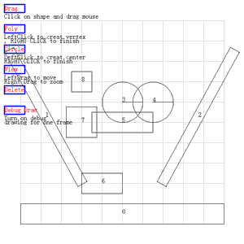

euler's equation

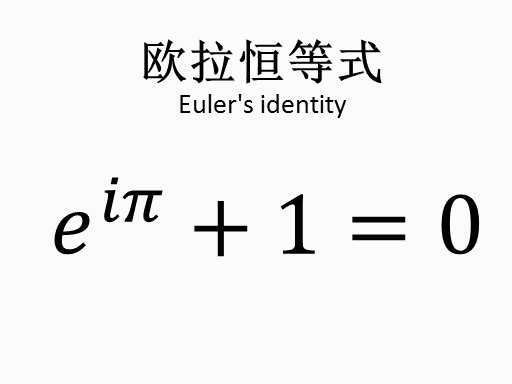

fourier transform

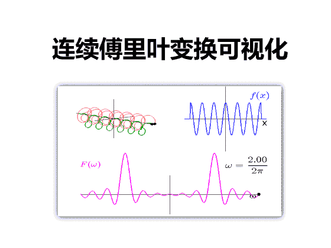

Diagonalization

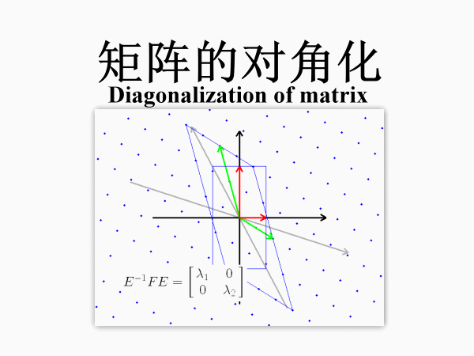

SVD

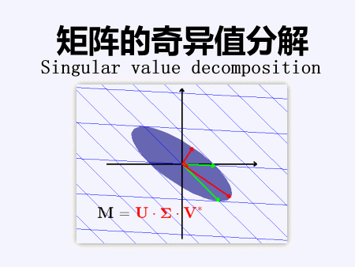

joukozsky transformation

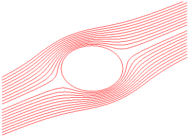

mohr's circle in 3D

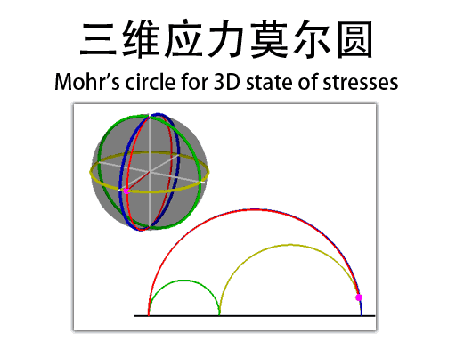

Hydraulic jump

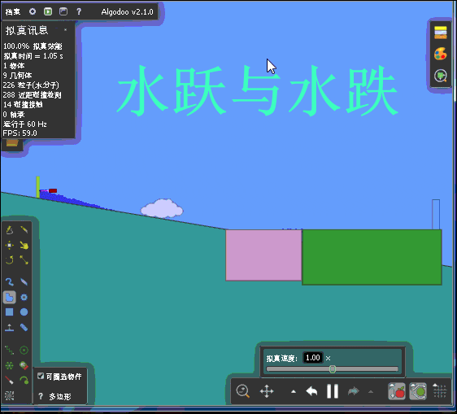

Venturi tube

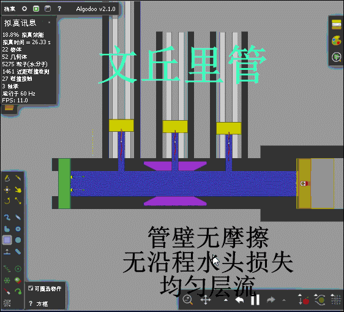

frictional head loss

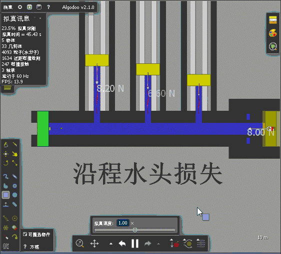

Laminar flow

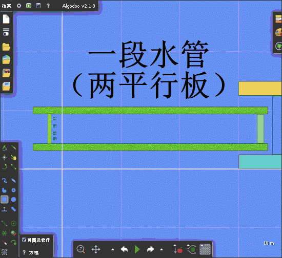

matrix multiplication

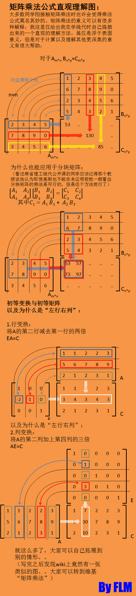

mandelbrot

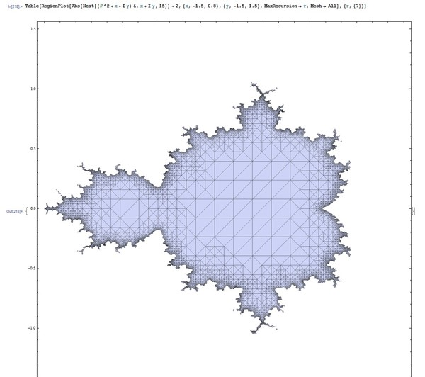

